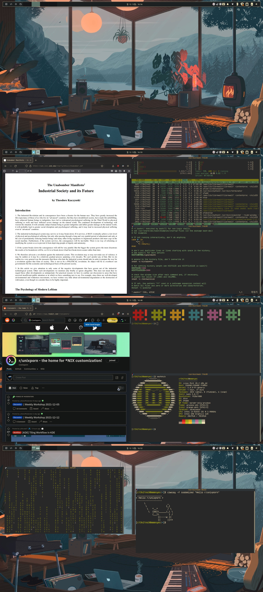

# linux_mint_dotfiles

This is my linux mint dotfile.

## Screenshots

## Links

gruvbox-gtk         : https://github.com/3ximus/gruvbox-gtk

tela circle         : https://github.com/vinceliuice/Tela-circle-icon-theme

ksuperkey           : https://snapcraft.io/install/ksuperkey/mint

border-only-gruvbox : https://github.com/c13h21no3/border-only-gruvbox

Agve nerd font	    : https://github.com/ryanoasis/nerd-fonts/releases/download/v2.1.0/Agave.zip

## Commands

### getting kakaotalk to work

playonlinux       : sudo apt install playonlinux

kakaotalk exe	  : wget https://app-pc.kakaocdn.net/talk/win32/KakaoTalk_Setup.exe

## How to use my setup

0. Download and apply things from Links section.

1. run this command to clone this repo

> git clone https://github.com/c13h21no3/linux_mint_dotfiles.git

2. replace your .bashrc whith mine by running this command

> cp linux_mint_dotfiles/.bashrc ~

3. run these commands to get my top panel design

> cp linux_mint_dotfiles/gtk.css ~/.config/gtk-3.0

> xfce4-panel -r

